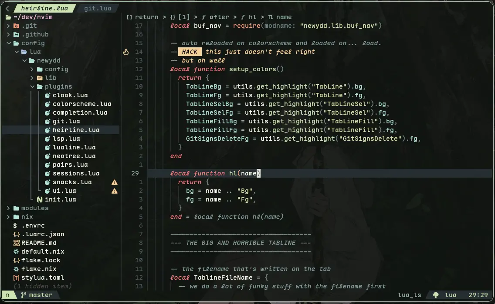

# Newydd



## Usage

### Run without installing
```bash
nix run github:anturated/nvim
```

### Install
If for whatever reason you want this installed,
add this to your flake's inputs and outputs
```nix
{
  inputs = {
    # this
    newydd = {
      url = "github:anturated/nvim";
      inputs.nixpkgs.follows = "nixpkgs";
    };
  };
  outputs =
    # this
    { newydd, ... }:
    {
      modules = [
        # and this
        newydd.packages."<your_arch>".default
      ];
    }
}
```

or if you're like that:

```bash
nix profile add github:anturated/nvim
```

## TODO
- [x] autopairs
- [x] omnisharp
- [x] better banner (or at least color it)
- [x] breadcrumbs
- [x] notif picker or bind
- [ ] nix lsp won't indent
- [ ] accent picker
- [ ] improve navic looks
- [ ] look through todos

## Thank/Credit
[isabelroses](https://github.com/isabelroses/nvim) - inspo for packaging this and some snippets
